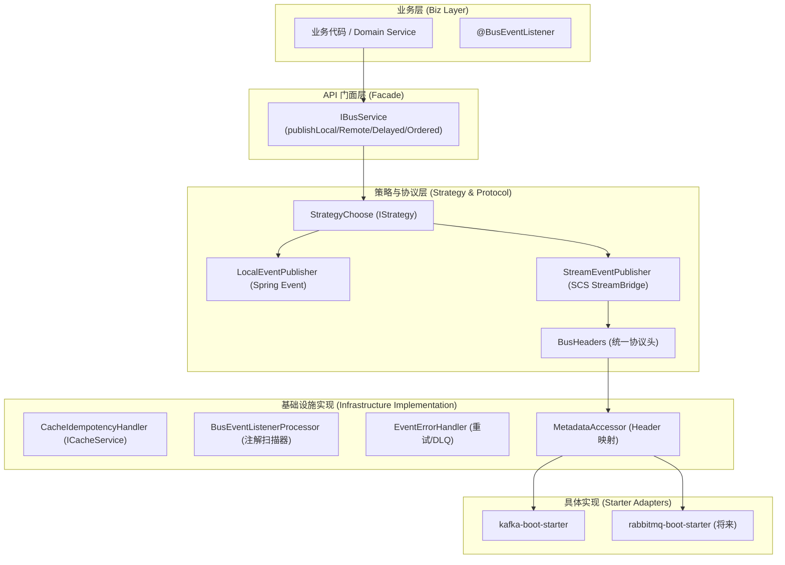

# 事件总线模块（component-bus）终极版设计方案

## 1. 核心定位
**企业级分布式事件总线抽象层**。对外提供统一的 `IBusService` 接口，对内基于 **Spring Cloud Stream (SCS)** 和 **Spring Integration** 实现，支持不同消息中间件（Kafka/RabbitMQ）的无感切换。

---

## 2. 总体架构 (UML 视图)



---

## 3. 关键设计原理

### 3.1 深度集成 Spring Cloud Stream (SCS)
- **原生复用**：直接利用 SCS 的 `bindings` 配置实现 **重试 (Retry)**、**死信队列 (DLQ)**、**分区 (Ordering)** 和 **消息持久化**。
- **透明发送**：`IBusService` 最终调用 `StreamBridge.send()`，通过 `ChannelInterceptor` 或 `MessageConverter` 将通用 Header 转换为 MQ 特有属性。

### 3.2 统一 Header 协议 (`BusHeaders`)
定义一套与中间件无关的元数据规范：
- `x-goya-delay`: 延迟毫秒数
- `x-goya-partition-key`: 消息排序分区键
- `x-goya-trace-id`: 链路追踪 ID
- `x-goya-idempotency-key`: 幂等去重键

### 3.3 策略注册机制 (`IStrategy`)
`EventPublisher` 实现类通过标识符注入 `StrategyChoose`：
- `LOCAL`: 处理同 JVM 内部通信。
- `DISTRIBUTED`: 处理跨服务分布式通信。
- 业务侧可根据环境动态选择发布策略。

---

## 4. 核心 API 定义

### IBusService - 业务唯一入口
```java
public interface IBusService {
    // 基础发布
    <E extends IEvent> void publishLocal(E event);
    <E extends IEvent> void publishRemote(E event);
    <E extends IEvent> void publishAll(E event);
    
    // 高级功能 (Header 抽象实现)
    <E extends IEvent> void publishDelayed(E event, Duration delay);
    <E extends IEvent> void publishOrdered(E event, String partitionKey);
}
```

### @BusEventListener - 声明式订阅
```java
public @interface BusEventListener {
    EventScope[] scope() default {EventScope.LOCAL};
    String condition() default "";     // SpEL 过滤
    boolean async() default false;     // 本地事件异步
    AckMode ackMode() default AckMode.AUTO; // 远程事件 ACK
    int maxRetries() default 3;        // 局部覆盖全局重试
}
```

---

## 5. 企业级特性落地

| 特性 | 抽象组件 | 实现技术点 |
|-----|---------|----------|
| **幂等处理** | `IdempotencyHandler` | 基于 `ICacheService` 的分布式去重键校验 |
| **错误处理** | `EventErrorHandler` | 集成 SCS 的报错机制 + `DlqConsumer` 审计记录 |
| **可观测性** | `EventMetrics` | Micrometer 收集处理时长/成功率；Sleuth 透传 TraceId |
| **适配层** | `Starter Adapters` | 在具体 Starter 中通过拦截器处理 `BusHeaders` 转换 |

---

## 6. 模块结构 (File Layout)

```
com.ysmjjsy.goya.component.bus
├── annotation        # @BusEventListener
├── configuration     # BusAutoConfiguration (配置映射逻辑)
├── definition        # IEvent, BaseEvent, BusHeaders, EventScope
├── handler           # CacheIdempotencyHandler, DefaultErrorHandler
├── processor         # BusEventListenerProcessor (核心 AOP/扫描逻辑)
├── publish           # LocalEventPublisher, StreamEventPublisher
└── service           # IBusService, BusServiceImpl
```

---

## 7. 演进路线图

1. **Phase 1 (MVP)**: 建立 `IBusService` + `LOCAL` 实现 + AOP 幂等检查。
2. **Phase 2 (SCS Core)**: 集成 `StreamBridge` 发送远程事件，映射基本 Header。
3. **Phase 3 (Enterprise)**: 完善 `BusEventListenerProcessor` 对重试和手动 ACK 的支持。
4. **Phase 4 (Observability)**: 打通链路追踪与微服务监控指标。
